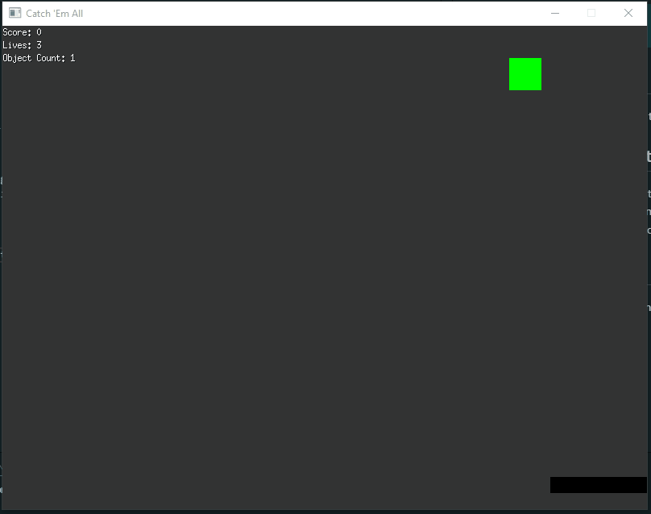

# Catch 'Em All!

## Overview

Catch 'Em All! is a simple 2D game developed using Go and Ebitengine. The player controls a paddle at the bottom of the screen using the mouse to catch falling objects while avoiding dangerous red cubes. The game ends when the player runs out of lives.

## Features
**Mouse Control:** Move the paddle left and right with your mouse.  
**Dynamic Object Spawning:** Objects fall from the top of the screen, with a mix of safe objects and dangerous red cubes.  
**Score and Lives Tracking:** Earn points by catching safe objects, and lose lives by catching dangerous cubes or missing safe ones.  
**Game Over Screen:** The game displays a Game Over screen when the player runs out of lives, with an option to restart.  

## How to Play

- Move your mouse left and right to control the paddle.  
- Catch the green objects to earn points.  
- Avoid the red objects, as they will reduce your lives.  
- The game ends when you lose all your lives.  

## Controls
**Mouse:** Move the paddle left and right.  
**Spacebar/Click:** Restart the game after a Game Over.

## Running The Game

If you don't want to clone the repo and already have Go installed you can run.

```sh
go run github.com/KalebHawkins/catchemall@latest
```

## Installation and Setup

Clone the repository:

```sh
git clone https://github.com/yourusername/catchemall.git
cd catch-em-all
```

Install dependencies:

Ensure you have Go installed.
Install Ebitengine:
```sh
go get -u github.com/hajimehoshi/ebiten/v2
```

Run the game:

```sh
go run main.go
```

## Game Preview



## Future Improvements
* Add sound effects for catching objects and losing lives.
* Implement power-ups and additional object types.
* Increase game difficulty over time with faster falling objects.

## License
This project is licensed under the Apache 2.0 License. See the LICENSE file for details.